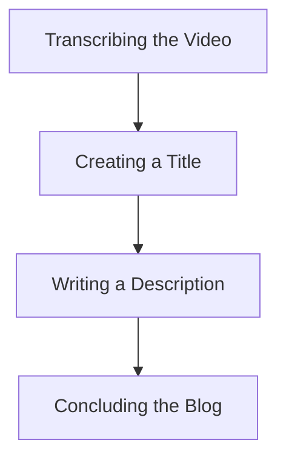

# Understanding AI: Generative AI, AI Agents, and Agentic AI

As artificial intelligence continues to evolve and permeate various aspects of technology and daily life, understanding the key concepts is essential. This article explores three pivotal areas of AI: generative AI, AI agents, and agentic AI. By breaking down these concepts, we aim to provide clarity on their differences, applications, and implications.

## Overview of AI Concepts

In the realm of AI, clarity is paramount. The three main concepts discussed are:

- **Generative AI**
- **AI Agents**
- **Agentic AI**

Each concept plays a crucial role in shaping how we interact with technology.

## Generative AI

Generative AI refers to models that have the capability to create new content based on existing datasets. This includes:

- **Content Types**: Text, images, audio, and video.
- **Examples**: Large language models (LLMs) like GPT-4 and LLaMA 3, which are built on billions of parameters.

The functionality of generative AI relies on prompts, which instruct the model on what content to generate.

### Generative AI Applications

Generative AI finds its utility in various applications, such as:

- **Chatbots**: Designed for generating human-like responses and content.

#### Key Properties

| Property               | Description                                      |
|-----------------------|--------------------------------------------------|
| **Reactive Nature**   | Responds to prompts.                            |
| **Content Generation**| Produces output based on user input.            |

## Libraries for Generative AI

To develop generative AI applications, several libraries are available, including:

- **LangChain**
- **LangGraph**
- **Llama Index**

These libraries facilitate the creation and integration of generative AI models into applications, enhancing their capabilities.

## AI Agents vs. Agentic AI

Though often used interchangeably, AI agents and agentic AI are distinct:

| Feature               | AI Agents                                    | Agentic AI                                  |
|-----------------------|----------------------------------------------|---------------------------------------------|
| **Task Execution**    | Perform specific tasks using LLMs.           | Involves collaboration of multiple agents. |
| **Data Retrieval**    | Operate within the confines of their training data. | Can manage complex workflows.              |
| **Real-time Data**    | Do not have real-time data retrieval capabilities. | Enhance efficiency through task sharing.   |

### Limitations of LLMs

It is important to note the limitations of LLMs:

- **Current Information**: LLMs cannot provide real-time updates unless connected to external databases or APIs.
- **Example**: Utilizing APIs like Tably allows LLMs to access up-to-date information.

## Tool Call Concept

When LLMs encounter situations where they cannot access required information, they can execute "tool calls" to external APIs. This capability allows them to:

- Retrieve data from third-party sources.
- Summarize and integrate that information into their responses.

## Example of Agentic AI Workflow

A practical example of agentic AI in action is converting a YouTube video into a blog post. This workflow can involve:

1. **Transcribing the Video**: One agent handles transcription.
2. **Creating a Title**: Another agent formulates a catchy title.
3. **Writing a Description**: A different agent crafts the blog description.
4. **Concluding the Blog**: Final agents compile and conclude the blog post.

Through collaboration, these agents work together to achieve a single, cohesive goal.

### Mermaid Diagram of Agentic AI Workflow

## Key Differences

Understanding the distinctions between AI agents and agentic AI is crucial:

| Aspect                | AI Agents                         | Agentic AI                                  |
|-----------------------|-----------------------------------|---------------------------------------------|
| **Task Scope**        | Execute single, isolated tasks.    | Involves collaboration to solve complex problems. |

## Conclusion

In conclusion, grasping the differences between generative AI, AI agents, and agentic AI is vital for leveraging these technologies effectively. Each concept plays a unique role in the landscape of AI, influencing how we automate workflows and interact with digital platforms. As these technologies continue to evolve, a clear understanding will be instrumental in maximizing their potential in various applications.

---

*Inspired by YouTube Video - [Watch here](https://www.youtube.com/watch?v=p4pHsuEf4Ms)*