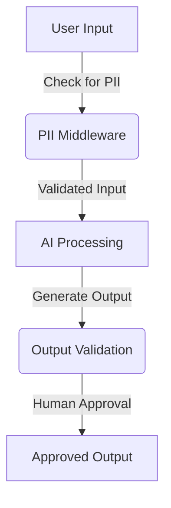

# Understanding Guardrails in AI Agent Development

In the rapidly evolving field of artificial intelligence, ensuring safety and compliance is paramount. This article explores the concept of guardrails in AI agent development, which serve as essential safety mechanisms. By defining their role, implementation methods, and practical applications, we aim to provide a comprehensive understanding of how guardrails contribute to safer AI workflows.

## What Are Guardrails?

Guardrails are defined as safety mechanisms that control the inputs and outputs within AI workflows. They play a crucial role in ensuring that AI agents operate within safe parameters:

- **Safe Input Processing**: Guardrails ensure that AI agents only process inputs that are deemed safe.
- **Approved Actions**: They restrict actions to those that are authorized, preventing unauthorized operations.
- **Validated Outputs**: Guardrails confirm that the outputs generated by AI agents meet safety standards.

## The AI Agent Workflow

A typical AI agent workflow consists of several key components:

1. **Inputs**: Data fed into the system, which can originate from various sources.
2. **Large Language Model (LLM)**: This model processes the inputs, potentially calling external tools or directly generating outputs based on the context.

Understanding this workflow is essential for implementing effective guardrails.

## The Importance of Guardrails

The primary purpose of guardrails is to prevent AI agents from responding to inappropriate or unsafe queries. For instance, guardrails can block harmful requests like:

- "How to hack a server"
- Other queries that may lead to dangerous or unethical outcomes

By implementing guardrails, developers can ensure compliance with safety standards, protecting both users and the integrity of the AI system.

## Approaches to Implementing Guardrails

There are two main approaches to integrating guardrails into AI systems:

### 1. Deterministic Approach
- **Description**: Utilizes rule-based algorithms for input validation, such as keyword matching.
- **Pros**: No costs associated with LLM usage.
- **Cons**: Limited semantic understanding, which may lead to false positives or negatives.

### 2. Model-Based Approach
- **Description**: Employs LLMs to assess input safety, providing contextual awareness.
- **Pros**: Offers a better understanding of nuances in language.
- **Cons**: Higher operational costs due to LLM usage.

| Approach Type       | Description                                  | Pros                                   | Cons                                               |
|---------------------|----------------------------------------------|----------------------------------------|----------------------------------------------------|
| Deterministic       | Rule-based input validation                  | No costs associated with LLM usage    | Limited semantic understanding                       |
| Model-Based         | LLMs assess input safety                     | Better language nuances understanding  | Higher operational costs due to LLM usage           |

## The Langchain Framework

Langchain is an open-source framework designed for implementing guardrails effectively. It uses middleware to manage AI workflows, enhancing safety measures throughout the process.

### Types of Middleware

Middleware plays a vital role in the functionality of guardrails. Key types include:

- **PII Middleware**: Detects personally identifiable information (e.g., emails, credit card numbers) and applies techniques such as masking or redaction.
- **Human-in-the-Loop Middleware**: Requires human approval before executing sensitive operations (e.g., financial transactions).
- **Before Agent and After Agent Hooks**: Custom hooks that can be applied to inputs before processing or to outputs after generation to ensure safety.

## Layered Guardrails

By combining multiple middleware solutions, developers can create layered guardrails. This comprehensive approach significantly enhances safety, allowing for more robust protection against potential risks.

## Practical Implementation

The video provides a detailed coding process to implement PII detection and human-in-the-loop middleware. This demonstration illustrates how these features can be seamlessly integrated into an AI agent, ensuring compliance and safety in real-world applications.

## Use Cases and Examples

Guardrails are particularly crucial in sensitive fields such as finance and healthcare. By preventing harmful requests and ensuring compliance, guardrails help maintain the integrity of AI operations. Examples include:

- **Finance**: Preventing unauthorized transactions.
- **Healthcare**: Ensuring sensitive patient data is not improperly processed.

## Conclusion

In conclusion, the importance of guardrails in AI development cannot be overstated. They serve as essential safety mechanisms that protect users and ensure compliance with ethical standards. By exploring the concepts and coding implementations discussed, developers can enhance the safety and reliability of their AI systems. Guardrails are not just an option; they are a necessity for responsible AI development.

---

*Inspired by YouTube Video - [Watch here](https://www.youtube.com/watch?v=ruiLq0OzjkI)*